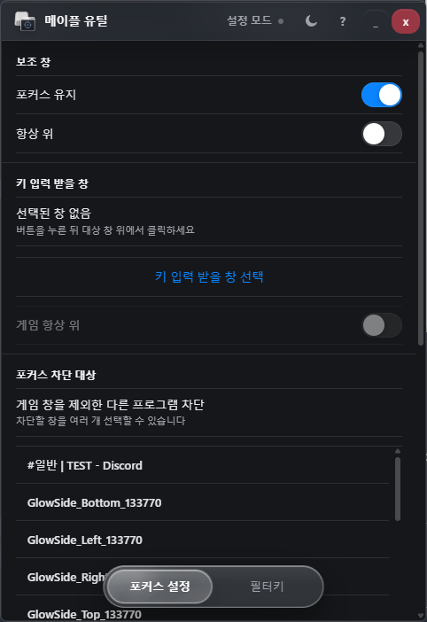
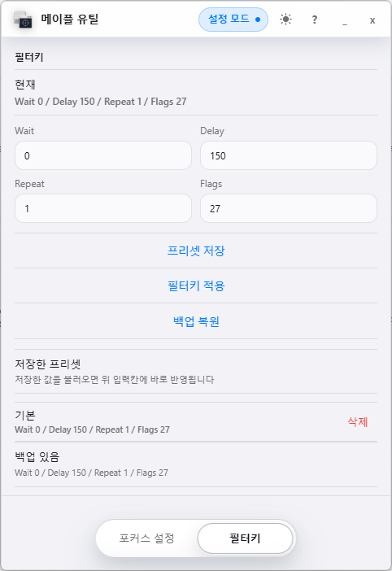

# Maple Utils

Maple Utils는 Windows에서 메이플스토리 플레이 중 보조 창을 항상 위에 두고, 다른 창을 클릭했을 때도 지정한 게임 창으로 키 입력을 유지하는 데 도움을 주는 개인용 유틸리티입니다.

## 주요 기능

- 키 입력을 받을 게임 창 선택
- 보조 창 항상 위 유지
- 다른 창의 포커스 획득 차단
- 입력 허용 예외 창 관리
- Windows 필터키 값 적용, 백업, 복원
- 필터키 프리셋 저장 및 불러오기

## 작동 화면

| 포커스 설정 | 필터키 |
| --- | --- |
|  |  |

## 사용법

1. Maple Utils를 실행합니다.
2. 상단의 `설정 모드`를 켭니다.
3. `키 입력 받을 창 선택`을 누른 뒤 메이플스토리 창 위에서 클릭합니다.
4. 필요에 따라 `포커스 유지`, `항상 위`, `게임 항상 위` 옵션을 켭니다.
5. 다른 프로그램 창을 클릭해도 키 입력이 게임 창으로 유지되는지 확인합니다.
6. 설정이 끝나면 `설정 모드`를 끄고 사용합니다.

## 포커스 차단 대상

`포커스 차단 대상`은 클릭해도 키보드 포커스를 가져가지 않게 만들 창 목록입니다.

- `선택 창 차단`: 선택한 창만 포커스 차단 대상으로 등록합니다.
- `선택 창 입력 허용`: 전체 차단을 사용해도 입력을 허용할 예외 창으로 등록합니다.
- `게임 제외 전체 차단`: 게임 창을 제외한 현재 선택 가능한 창들을 차단합니다.
- `차단 해제`: 등록된 차단 대상을 모두 해제합니다.

## 포커스 유지 동작 방식

Maple Utils의 포커스 기능은 게임 프로세스의 메모리, 파일, 네트워크, 입력 값을 직접 조작하지 않습니다. Windows가 제공하는 창 핸들(HWND), 창 스타일, foreground window API를 사용해 "어느 창이 키보드 포커스를 받을지"를 조정합니다.

기본 흐름은 다음과 같습니다.

1. 사용자가 `키 입력 받을 창 선택`으로 메이플스토리 창을 지정합니다.
2. 사용자가 `선택 창 차단` 또는 `게임 제외 전체 차단`으로 보조 창을 차단 대상으로 등록합니다.
3. 차단 대상 창에는 Windows 확장 스타일인 `WS_EX_NOACTIVATE`를 적용합니다.
4. Chrome처럼 내부 child window가 키보드 포커스를 다시 가져가는 프로그램을 위해, 차단 대상의 child HWND에도 같은 `WS_EX_NOACTIVATE` 스타일을 적용합니다.
5. 차단을 해제하거나 앱이 종료될 때는 저장해 둔 원래 창 스타일로 복원합니다.
6. `설정 모드`가 꺼져 있고 `포커스 유지`가 켜져 있을 때만, 현재 foreground 창을 설정된 감시 주기마다 확인합니다.
7. foreground 창이 차단 대상 또는 차단 대상의 같은 root window로 확인되면, 차단 대상 스타일을 다시 적용한 뒤 지정한 게임 창을 foreground로 되돌립니다.

이 동작은 Chrome 대응을 위해 추가되었습니다. Chrome은 탭, 주소창, 렌더러 영역 등 내부 창 구조가 복잡해서 최상위 창 하나만 `WS_EX_NOACTIVATE` 처리해도 키보드 포커스를 다시 가져가는 경우가 있습니다. 그래서 차단 대상의 child HWND까지 처리하고, Chrome이 foreground를 가져간 순간을 감지해 게임 창을 다시 앞으로 가져옵니다.

`설정 모드`가 켜져 있으면 포커스 유지 동작은 의도적으로 중지됩니다. 설정 중에는 사용자가 Maple Utils UI를 클릭하고 조작해야 하므로, 테스트할 때는 설정을 마친 뒤 `설정 모드`를 끄고 확인해야 합니다.

### 감시 주기 설정

`감시 주기`는 Chrome 같은 차단 대상 창이 foreground를 가져갔는지 확인하는 간격입니다. 기본값은 `75ms`입니다.

- `75ms`: 기본값입니다. 호출 빈도가 낮고 비교적 보수적입니다.
- `30ms`: 포커스 복귀가 더 빠릅니다. 키다운 스킬 끊김이 느껴질 때 먼저 시도할 값입니다.
- `16ms`: 약 60fps에 가까운 간격입니다. 가장 빠르게 반응하지만 Windows API 호출 빈도가 가장 높습니다.

감시 주기를 낮춘다고 키 입력을 직접 조작하는 것은 아니지만, foreground 확인과 포커스 복구 시도가 더 자주 일어납니다. 필요한 경우에만 낮은 값을 사용하세요.

## 사용 중인 Windows 동작

포커스 기능에서 사용하는 동작은 대략 아래 범위입니다.

- 현재 foreground 창 확인: `GetForegroundWindow`
- 창 목록과 child window 확인: `EnumWindows`, `EnumChildWindows`, `GetAncestor`
- 창 스타일 확인 및 변경: `GetWindowLongPtrW`, `SetWindowLongPtrW`, `SetWindowPos`
- 게임 창을 다시 앞으로 가져오기: `SetForegroundWindow`, `BringWindowToTop`, `SetActiveWindow`, `SetFocus`, `AttachThreadInput`

아래와 같은 게임 메모리 조작 계열 동작은 사용하지 않습니다.

- `OpenProcess`
- `ReadProcessMemory`
- `WriteProcessMemory`
- `CreateRemoteThread`
- DLL injection
- 게임 프로세스 메모리 스캔
- 자동 입력을 위한 `SendInput`
- 상시 키보드 입력 후킹

## 위험성 및 주의 사항

이 프로그램은 게임 클라이언트 메모리를 읽거나 쓰지 않지만, 외부 프로그램이 게임 창의 foreground 상태와 다른 프로그램 창의 포커스 획득 여부에 관여합니다. 따라서 "메모리 조작이 아니므로 무조건 안전하다"는 의미는 아닙니다.

사용자는 다음 위험을 이해하고 사용해야 합니다.

- 게임 운영 정책이나 보안 프로그램의 판단 기준은 공개되어 있지 않으며 언제든 변경될 수 있습니다.
- 외부 프로그램이 게임 창 포커스를 강제로 유지하는 행위 자체가 문제로 해석될 가능성을 완전히 배제할 수 없습니다.
- 차단 대상 창의 Windows 스타일을 임시로 바꾸므로, Chrome 같은 보조 프로그램의 클릭/입력 동작이 평소와 다르게 느껴질 수 있습니다.
- 앱이 비정상 종료되면 일부 차단 대상 창 스타일이 즉시 복원되지 않을 수 있습니다. 이 경우 해당 프로그램을 재시작하거나 Maple Utils를 다시 실행한 뒤 `차단 해제`를 누르세요.
- 관리자 권한 수준이 서로 다르면 Windows가 포커스 제어나 창 스타일 변경을 막을 수 있습니다. 메이플스토리가 관리자 권한으로 실행 중이면 Maple Utils도 같은 권한으로 실행해야 합니다.

가장 보수적으로 사용하려면 필요한 보조 창만 `선택 창 차단`으로 등록하고, 사용하지 않을 때는 `차단 해제`를 누른 뒤 Maple Utils를 종료하세요.

## 필터키

필터키 기능은 Windows 접근성 설정의 필터키 값을 변경합니다.

- `프리셋 저장`: 현재 입력한 필터키 값을 이름을 붙여 저장합니다.
- `필터키 적용`: 현재 입력한 값을 Windows에 적용합니다.
- `백업 복원`: 적용 전 저장된 Windows 필터키 값으로 되돌립니다.

기본값은 개발자가 평소에 사용하는 값으로 다음과 같습니다.

```text
Wait 0 / Delay 150 / Repeat 1 / Flags 27
```

## 관리자 권한

메이플스토리가 관리자 권한으로 실행 중이면 Maple Utils도 관리자 권한으로 실행해야 창 선택과 포커스 제어가 정상 동작할 수 있습니다.


## 면책 조항

이 프로그램은 사용자의 편의를 위한 보조 도구이며, 게임 클라이언트 파일을 수정하거나 게임 메모리를 조작하거나 자동 사냥, 자동 입력, 매크로 기능을 제공하지 않습니다. 다만 Windows 창 포커스와 창 스타일을 조정하는 외부 유틸리티입니다.

다만 게임 운영 정책, 이용 약관, 보안 프로그램의 판단 기준은 언제든 변경될 수 있으며, 외부 프로그램 사용 자체가 문제로 해석될 가능성을 완전히 배제할 수 없습니다. 이 프로그램 사용으로 인해 발생할 수 있는 계정 제재, 이용 제한, 데이터 손실, 기타 불이익에 대해 제작자는 책임지지 않습니다.

사용 전 반드시 본인이 이용 중인 게임의 운영 정책과 약관을 확인하고, 모든 책임은 사용자 본인에게 있음을 이해한 뒤 사용하세요.


## 개발

필요 환경:

- Node.js
- npm
- Rust
- Tauri CLI

의존성 설치:

```powershell
npm install
```

개발 실행:

```powershell
npm run tauri:dev
```

릴리스 빌드:

```powershell
npm run tauri:build
```

빌드된 실행 파일은 기본적으로 아래 경로에 생성됩니다.

```text
src-tauri/target/release/maple-utils.exe
```

## GitHub Release 배포

이 저장소는 GitHub Actions로 Windows 실행 파일을 빌드하고 Release에 첨부할 수 있습니다.

태그를 만들고 push하면 자동으로 Release가 생성됩니다.

```powershell
git tag v0.1.0
git push origin v0.1.0
```

성공하면 GitHub의 `Releases` 페이지에 아래 형식의 파일이 올라갑니다.

```text
Maple-Utils-v0.1.0.exe
```
